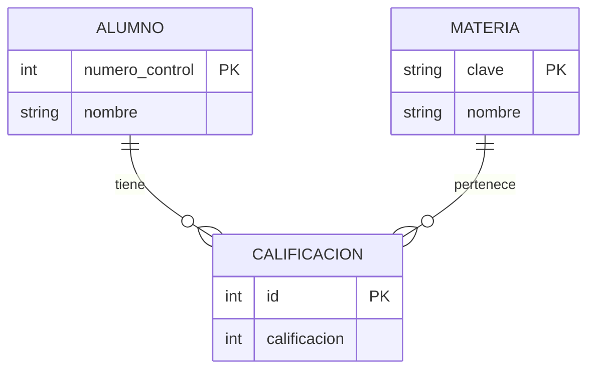

# 4.1 Introducción

## El Problema de la Memoria Volátil

Hasta este punto del curso, nuestros programas tienen amnesia.
Si creas una lista de usuarios `users = []` y cierras el programa, los datos desaparecen para siempre al apagarse la RAM.
La **Persistencia** es el arte de hacer que los datos sobrevivan al proceso que los creó, guardándolos en un medio no volátil (Disco Duro, SSD, Cloud).

### Opciones de Persistencia en Python
No todo requiere una Base de Datos gigante.

1.  **Archivos Planos (.txt, .csv):**
    *   *Uso:* Logs, configuraciones simples.
    *   *Problema:* No hay búsqueda rápida. Para buscar algo al final, debes leer todo el archivo. Concurrencia imposible (si dos escriben -> corrupción).

2.  **Serialización (JSON/Pickle):**
    *   *Uso:* Guardar estado de objetos.
    *   *Problema:* Debes cargar TODO en RAM para usarlo. No escala a millones de registros.

3.  **Base de Datos Relacional (RDBMS):**
    *   *Uso:* El estándar mundial (SQL).
    *   *Ventaja:* Índices (búsqueda O(log N)), Integridad, Concurrencia.

4.  **NoSQL (KeyValue, Document):**
    *   *Uso:* Big Data, esquemas flexibles (MongoDB, Redis).

En esta materia nos centramos en **RDBMS (SQL)** porque es la base de la ingeniería informática.

---

## El Modelo Relacional y SQL

Propuesto por E.F. Codd en 1970.
La idea: Los datos se guardan en **Tablas** (Relaciones) y se vinculan mediante **Llaves**.

### Conceptos Fundamentales
*   **Tabla (Table):** Entidad (Ej. `Usuarios`).
*   **Fila (Row/Tuple):** Instancia (Ej. `Juan Pérez`).
*   **Columna (Column/Attribute):** Propiedad (Ej. `email`).
*   **Primary Key (PK):** Identificador único e irrepetible (Ej. `ID=5`).
*   **Foreign Key (FK):** Referencia a una PK de otra tabla (Relación).

### SQL (Structured Query Language)
Es el lenguaje declarativo para hablar con la base de datos.
Se divide en sub-lenguajes:
*   **DDL (Definition):** `CREATE`, `DROP`, `ALTER`. (Estructura).
*   **DML (Manipulation):** `INSERT`, `UPDATE`, `DELETE`. (Datos).
*   **DQL (Query):** `SELECT`. (Lectura).
*   **DCL (Control):** `GRANT`, `REVOKE`. (Permisos).

---

## Propiedades ACID (La Garantía Bancaria)

Una base de datos "seria" debe cumplir ACID. Si no, es un juguete.
Imagina una transferencia bancaria: Restar $100 a A, Sumar $100 a B.

1.  **A - Atomicidad (Atomicity):**
    "Todo o Nada". Si se va la luz justo después de restar a A, pero antes de sumar a B, la operación **completa** se cancela (Rollback). El dinero no desaparece.

2.  **C - Consistencia (Consistency):**
    La BD pasa de un estado válido a otro estado válido. Se respetan las "Constraints" (ej. no puede haber saldo negativo, el ID debe ser único).

3.  **I - Aislamiento (Isolation):**
    Si dos transacciones ocurren al mismo tiempo, no se ven entre sí hasta que terminan.
    Si yo leo mi saldo mientras tú me transfieres, veré el saldo viejo o el nuevo, nunca un saldo a medias. (Niveles: Read Committed, Serializable).

4.  **D - Durabilidad (Durability):**
    Una vez que la BD dice "Commit OK", el dato está grabado en piedra (disco). Aunque el servidor explote 1 milisegundo después, el dato no se pierde (Write-Ahead Logging).

---

## SQLite: El Gigante Silencioso

Para aprender (y para muchas Apps reales), no instalaremos Oracle ni PostgreSQL. Usaremos **SQLite**.

### ¿Qué es SQLite?
*   Es una librería C, no un servidor.
*   La base de datos es **un solo archivo** en tu disco (`mi_base.db`).
*   Es la BD más desplegada del mundo (está en cada Android, iPhone, navegador Chrome y Windows 10).
*   Soporta ACID completo.
*   Límite: 140 Terabytes (Teóricamente).

**¿Por qué SQLite en Python?**
Porque Python trae el soporte nativo en la librería estándar (`sqlite3`). Cero configuración.

### SQLite vs MySQL/Postgres

| Característica | SQLite | PostgreSQL / MySQL |
| :--- | :--- | :--- |
| **Arquitectura** | Serverless (Librería) | Cliente-Servidor (TCP/IP) |
| **Usuarios** | Mono-usuario (Local) | Multi-usuario concurrente |
| **Configuración** | Ninguna | Compleja (Puertos, Users) |
| **Uso Ideal** | App Móvil, App Escritorio, Prototipos | Web Apps grandes, Enterprise |

---

## Diseño de Base de Datos: Normalización

Antes de tirar código, hay que diseñar. Un mal diseño (mala normalización) causa redundancia y anomalías.

### Las 3 Formas Normales (Resumen Práctico)

**Tablas de Ejemplo:**

*Mal Diseño (Excel style):*
Tabla `Ventas`:
`ID | Producto | Precio | Cliente | Direccion_Cliente`
`1 | Laptop | 1000 | Juan | Av.1`
`2 | Mouse | 50 | Juan | Av.1`
*Problema:* Si Juan se muda, tengo que actualizar 2 filas. Si borro las ventas, pierdo la dirección de Juan.

**1FN (Atomicidad):**
Cada celda debe tener un solo valor. (No poner "Tel1, Tel2" en una celda).

**2FN y 3FN (Separación de temas):**
Separar en tablas vinculadas.

Tabla `Clientes`:
`ID_C (PK) | Nombre | Direccion`
`10 | Juan | Av.1`

Tabla `Productos`:
`ID_P (PK) | Descripcion | Precio`
`50 | Laptop | 1000`

Tabla `Ventas`:
`ID_V (PK) | FK_Cliente | FK_Producto`
`1 | 10 | 50`

Ahora los datos viven en un solo lugar. La `Venta` solo apunta a ellos.

---

## Tipos de Datos en SQLite

SQLite usa un sistema de tipos dinámico (Dynamic Typing), raro en SQL pero similar a Python.
Clases de almacenamiento:
1.  **NULL**: Valor nulo.
2.  **INTEGER**: Entero (1, 2, 3, 4, 6, 8 bytes).
3.  **REAL**: Flotante (IEEE).
4.  **TEXT**: String (UTF-8).
5.  **BLOB**: Datos binarios crudos (imágenes, archivos).

**¿Y las Fechas?**
SQLite no tiene tipo `DATETIME`.
Convención: Guardarlas como `TEXT` (ISO8601 Strings: "2023-10-30 14:00:00") o `REAL` (Unix Timestamps).

---

## Diagramas Entidad-Relación (ERD)

Como parte de su proyecto, deben entregar un diagrama ER.
Herramientas recomendadas:
*   Mermaid.js (Texto a Gráfico).
*   dbeaver (Ingeniería Inversa).
*   MySQL Workbench.

### Ejemplo Mermaid

*Interpretación:* Un Alumno tiene muchas calificaciones (1 a N). Una Materia aparece en muchas calificaciones.

---

## Laboratorio Teórico

Diseñar el esquema para una Biblioteca.
Requerimientos:
1.  Libros (ISBN, Título, Autor).
2.  Usuarios (ID, Nombre).
3.  Préstamos (Quién se llevó Qué y Cuándo).

*Reto:* Un libro puede tener varios autores. Un autor escribe varios libros.
Esto es una relación **Many-to-Many (N:M)**.
Requiere una tabla intermedia `Autor_Libro` que tenga `(FK_Libro, FK_Autor)`.

En la siguiente unidad (4.2), implementaremos este diseño usando código Python.


---

## Arquitectura de Conexiones: El Costo Oculto

Un error de novato es:
```python
def obtener_usuario(id):
    conn = conectar() # ❌ LENTO
    res = conn.query(...)
    conn.close()
    return res
```
Abrir una conexión (TCP Handshake + Autenticación + SSL) cuesta ~50-100ms.
Si tienes 100 usuarios/seg, tu servidor pasará el 90% del tiempo abriendo sockets y solo 10% consultando datos.

### Connection Pooling
La solución es mantener una **piscina de conexiones** abiertas.
Cuando pides una conexión, el Pool te presta una ya abierta. Al cerrarla, no se desconecta, solo vuelve al Pool.
(Esto lo gestiona SQLAlchemy automáticamente, pero es vital saber que existe).

---

## Niveles de Aislamiento (Isolation Levels)

ACID dice "Aislamiento", pero ¿qué tanto aislamiento?
Más aislamiento = Menos Concurrencia (Bloqueos).
Menos aislamiento = Más Bugs de Datos.

### Dirty Read (Lectura Sucia)
*   Transacción A escribe DATO=5 (pero no hace commit aún).
*   Transacción B lee DATO=5.
*   Transacción A hace Rollback (DATO vuelve a ser 0).
*   **Problema:** B está trabajando con un dato fantasma que nunca existió realmente.
*   *Solución:* Nivel `READ COMMITTED`.

### Non-Repeatable Read
*   A lee SALDO=100.
*   B actualiza SALDO=50 y hace commit.
*   A vuelve a leer SALDO y ahora es 50.
*   **Problema:** Dentro de la misma transacción, el dato cambió "mágicamente".
*   *Solución:* Nivel `REPEATABLE READ`.

### Phantom Read
*   A hace `SELECT * FROM users`. (Recibe 10 filas).
*   B hace `INSERT INTO users`.
*   A vuelve a hacer `SELECT *`. (Recibe 11 filas).
*   **Problema:** Aparecieron datos de la nada.
*   *Solución:* Nivel `SERIALIZABLE` (El más estricto y lento, bloquea toda la tabla).

SQLite por defecto es muy estricto (bloquea todo el archivo al escribir). Postgres usa `READ COMMITTED` por default.

---

## DB-API 2.0 Internals (PEP 249)

Todos los drivers de Python (`sqlite3`, `psycopg2`, `mysqlclient`) siguen la misma interfaz.
Si aprendes `cursor.execute()` aquí, ya sabes usar Oracle.

La diferencia interna:
*   `cursor` en SQLite recorre el archivo local en C.
*   `cursor` en Postgres envía paquetes de red al puerto 5432 y espera bytes de respuesta.

**Paramstyle:**
*   `qmark`: `?` (Usado por SQLite/ODBC).
*   `numeric`: `:1` (Usado por Oracle).
*   `named`: `:nombre` (Alternativo).
*   `format`: `%s` (Usado por MySQL/Postgres - Ojo, ¡esto NO es f-string!).

---


---

## SQLite Internals: Anatomía del Archivo .db

¿Cómo guarda SQLite los datos en un solo archivo de manera eficiente?
No es texto plano. Es una estructura binaria basada en **Páginas**.

### Páginas y B-Trees
El archivo `.db` se divide en bloques de tamaño fijo (usualmente 4KB), llamadas páginas.
*   **B-Tree Pages:** Las tablas e índices se almacenan usando árboles B+ (B-Plus Trees).
*   **Root Page:** La página 1 contiene el esquema (`sqlite_master`).

Cuando haces `SELECT * FROM users WHERE id=500`, SQLite:
1.  Lee la raíz del B-Tree (Página 1).
2.  Navega por los punteros internos (O(log N)) saltando páginas.
3.  Llega a la página hoja (Leaf Page) donde está el ID 500.
4.  Lee solo esos 4KB de disco a RAM.

### Write-Ahead Log (WAL)
En modo moderno, SQLite usa un archivo journal `-wal`.
1.  Las escrituras (`INSERT`) se añaden al final del archivo WAL (muy rápido, secuencial).
2.  Los lectores leen del archivo original + el WAL.
3.  Periódicamente, un "Checkpoint" mueve los datos del WAL al DB original.
Esto permite concurrencia real: **Un escritor y múltiples lectores al mismo tiempo.**


---

## Álgebra Relacional: La Matemática Detrás de SQL

Antes de que existiera SQL, existía el Álgebra Relacional (Codd).
Cuando escribes una Query, el "Query Optimizer" de la BD la convierte en estas operaciones matemáticas para encontrar la ruta más rápida.

### Operadores Primitivos
1.  **Selección ($\sigma$ - Sigma):**
    *   Filtrar filas (WHERE).
    *   $\sigma_{edad > 18}(Usuarios)$
2.  **Proyección ($\pi$ - Pi):**
    *   Seleccionar columnas (SELECT col1, col2).
    *   $\pi_{nombre, email}(Usuarios)$
3.  **Producto Cartesiano ($\times$):**
    *   Combinar todas las filas con todas las filas (CROSS JOIN).
    *   $A \times B$ (Si A tiene M filas y B tiene N, resultado $M \times N$).

### Operadores Derivados (Joins)
El **Join** ($\bowtie$) no es mágico. Es una composición:
$A \bowtie_{id} B = \sigma_{A.id = B.id}(A \times B)$
1.  Haz el producto cartesiano gigante.
2.  Quedate solo con las filas donde los IDs coinciden.

*Nota:* Las BDs modernas no hacen esto literalmente (sería lentísimo). Usan algoritmos como **Hash Join** o **Merge Join**.

---


---

## Teorema CAP (Brewer's Theorem)

En sistemas distribuidos (Cloud Computing), es imposible tenerlo todo.
El Teorema CAP dicta que solo puedes elegir **2 de 3**:

1.  **C (Consistency):** Todos ven los mismos datos al mismo tiempo. (Si escribo X=5 en Tokio, Nueva York lee 5 inmediatamente).
2.  **A (Availability):** El sistema siempre responde, aunque algunos servidores estén caídos.
3.  **P (Partition Tolerance):** El sistema sigue funcionando si se corta el cable submarino entre Tokio y NY.

**El Dilema:**
En Internet, la partición (P) **siempre** puede ocurrir. Así que solo eliges entre **CP** o **AP**.
*   **CP (Bancos - SQL tradicional):** Si se cae la red, el sistema **se bloquea** y rechaza peticiones para evitar datos incorrectos. (Prefiero no vender a vender 2 veces).
*   **AP (Facebook, Twitter - NoSQL):** Si se cae la red, te dejo postear, pero quizás tus amigos no lo vean hasta dentro de 5 minutos (Eventual Consistency).

---

## NoSQL Deep Dive: Más allá de Relacional

Cuando SQL no escala (Petabytes de datos), usamos NoSQL.

### Key-Value (Redis, DynamoDB)
*   Como un diccionario gigante de Python.
*   **Uso:** Caché, Carritos de compra, Sesiones.
*   **Ventaja:** Busquedas O(1) ultra rápidas (microsegundos).
*   **Desventaja:** "Dáme todos los usuarios de México" -> Imposible sin escanear todo.

### Document Store (MongoDB, Firestore)
*   Guarda JSONs (BSON).
*   **Uso:** Catálogos de productos (donde cada producto tiene atributos distintos), Perfiles de usuario.
*   **Ventaja:** Flexible (Schema-less).
*   **Desventaja:** No hay JOINS. Duplicidad de datos.

### Column Family (Cassandra, HBase)
*   Guarda por columnas, no filas.
*   **Uso:** Time-Series (IoT, Logs, Métricas financieras).
*   **Ventaja:** Escrituras masivas (millones/seg). Compresión brutal.

### Graph DB (Neo4j)
*   Guarda Nodos y Aristas (Relaciones).
*   **Uso:** Redes sociales (Amigos de amigos), Motores de recomendación, Detección de fraude.
*   **Ventaja:** Queries de relaciones profundas ("Amigo del amigo del vecino") son instantáneas.

---

## Arquitectura Distribuida: Sharding y Replication

¿Qué pasa si tu tabla `Users` pesa 10TB y no cabe en un disco duro?

### Sharding (Fragmentación Horizontal)
Dividir la tabla en pedazos y guardarlos en servidores distintos.
*   Shard 1: Usuarios A-M (Server IP 1).
*   Shard 2: Usuarios N-Z (Server IP 2).
*   **Reto:** ¿Qué pasa si haces un Join entre Shard 1 y Shard 2? Es lentísimo y complejo.

### Replication (Master-Slave)
*   1 Servidor **Master (Writer):** Recibe todos los `INSERT/UPDATE`.
*   5 Servidores **Replica (Readers):** Copian los datos del Master. Solo sirven `SELECT`.
*   **Ventaja:** Escala la lectura infinitamente.
*   **Desventaja:** Lag de replicación. (Escribes en Master, lees en Replica inmediatamente -> Dato viejo).

---

## NewSQL: Lo mejor de dos mundos

Sistemas modernos como **CockroachDB** o **Google Spanner**.
*   Hablan SQL (ACID garantizado).
*   Escalan horizontalmente como NoSQL (automáticamente hacen Sharding y Replicación mundial con relojes atómicos).
*   Son el futuro de las bases de datos transaccionales globales.

---


---

## Vector Databases: La Era de la IA (RAG)

Con el auge de GPT-4, nació una nueva necesidad: **Búsqueda Semántica**.
SQL busca por texto exacto (`LIKE '%gato%'`).
Vector DB busca por **significado** ("animal felino mascota").

### Embeddings
Una red neuronal convierte texto en una lista de números (vector de 1536 dimensiones).
`"Gato"` -> `[0.1, 0.9, -0.5, ...]`
`"Perro"` -> `[0.1, 0.8, -0.4, ...]` (Cercano).
`"Pizza"` -> `[0.9, -0.1, 0.2, ...]` (Lejano).

### Motores Vectoriales (Pinecone, Milvus, pgvector)
Usan algoritmos como **HNSW (Hierarchical Navigable Small World)** para encontrar los vectores más cercanos en milisegundos entre mil millones de opciones.
PostgreSQL ahora tiene la extensión `pgvector` que le permite hacer esto nativamente.

---

## Distributed Consensus: Raft & Paxos

¿Cómo saben 5 servidores quién es el líder?
Si dos servidores creen que son el líder (Split Brain), corromperán los datos.
Necesitan un algoritmo de consenso.

### Algoritmo Raft (El estándar moderno)
Visualiza una democracia:
1.  **Election Timeout:** Si un seguidor no escucha del líder en 150ms, se autoproclama Candidato.
2.  **RequestVote:** Pide votos a los demás.
3.  **Majority:** Si obtiene N/2 + 1 votos, es el nuevo Líder.
4.  **Heartbeat:** Envía "pulsos" vacíos cada 50ms para decir "Sigo vivo, no voten por otro".

Sistemas como **etcd** (el cerebro de Kubernetes) usan Raft. Si etcd muere, tu cluster de microservicios muere.

---

## Consistent Hashing (El secreto de Amazon Dynamo)

En el Sharding tradicional (`UserID % 5 Servidores`), si agregas un servidor #6, la fórmula cambia (`UserID % 6`).
Eso obliga a mover el 90% de los datos de servidor. ¡Desastre total en producción!

**Solución: Consistent Hashing (Anillo).**
Los servidores y los datos se mapean a un círculo de 0 a 360 grados.
Un dato pertenece al "primer servidor que encuentre girando a la derecha".
Si agregas un servidor, solo toma los datos de **su vecino**, no de todo el cluster.
Esto permite "Elastic Scaling" (agregar/quitar nodos sin tirar el sistema).

---

## Benchmarks: SQL vs NoSQL (La Verdad Incómoda)

| Operación | PostgreSQL (SQL) | MongoDB (Doc) | Redis (KV) |
| :--- | :--- | :--- | :--- |
| **Insert 1M filas** | 5 seg (Transaccional) | 3 seg (Fire & forget) | 0.5 seg (RAM) |
| **Select por ID** | 0.2 ms | 0.2 ms | 0.05 ms |
| **Complex Join** | 50 ms (Optimizado) | N/A (Manual en app: 500ms) | N/A |
| **Consumo RAM** | 100 MB | 500 MB (Java/V8 engine) | Todo lo que le des |

**Conclusión:**
*   **Redis** es invencible en velocidad pura (Caché).
*   **Postgres** es invencible en consistencia y consultas complejas.
*   **Mongo** es bueno para prototipar rápido, pero pierde en rendimiento puro contra un Postgres bien tuneado (JSONB).

---

## Glosario de Base de Datos Avanzado

*   **Hot Spot:** Cuando todos los usuarios acceden al mismo shard (ej. Justin Bieber tweetea y millones leen esa fila DB al mismo tiempo).
*   **Thundering Herd:** Cuando expira el caché y 10,000 requests golpean la DB al mismo milisegundo.
*   **Write Amplification:** Un INSERT lógico causa 10 escrituras físicas en disco (Data + Index 1 + Index 2 + WAL + Replica).
*   **IOPS:** Input/Output Operations Per Second. La moneda de cambio en la nube (AWS cobra por IOPS).

---


---

## Formatos Big Data: Parquet vs CSV

Si trabajas con Data Engineering, **CSV es tu enemigo**.
*   CSV no tiene tipos (¿es "10" un int o un string?).
*   CSV es lento de leer (hay que parsear comas y saltos de línea).
*   CSV ocupa mucho espacio (texto plano).

**Apache Parquet:**
Es un formato **binario** y **columnar**.
*   **Columnar:** Si solo haces `SELECT edad FROM users`, Parquet solo lee la columna `edad` del disco. CSV tiene que leer TODO el archivo fila por fila.
*   **Compresión:** Usa Snappy/GZIP por columna. Los enteros se comprimen mejor juntos.
*   **Schema:** El archivo sabe que "edad" es `INT32`.

**Benchmark:**
Leer 1GB de datos:
*   CSV: 15 segundos.
*   Parquet: 0.5 segundos.

---

## Apache Arrow: El Bus de Datos

Históricamente, mover datos era costoso:
*   Python (Pandas) -> Serializar a Bytes -> Enviar Socket -> Spark -> Deserializar.
*   Cada paso copia la memoria y quema CPU.

**Apache Arrow** define un **layout de memoria estándar**.
*   Pandas usa Arrow en RAM.
*   Spark usa Arrow en RAM.
*   Para mover datos de Pandas a Spark: **Zero-Copy**. Solo se pasa el puntero de memoria.
*   No hay serialización.

Arrow es la base de las librerías modernas de Data Science (Polars, PyArrow, Dux). Si usas Pandas 2.0, úsalo con el backend de Arrow (`dtype_backend='pyarrow'`) para ganar 50x velocidad.

---


---

## El Teorema CAP (Brewer's Theorem)

En Sistemas Distribuidos, NO puedes tenerlo todo.
Debes elegir 2 de 3:
1.  **C (Consistency):** Todos los nodos ven los mismos datos al mismo tiempo.
2.  **A (Availability):** El sistema siempre responde (aunque sea con datos viejos).
3.  **P (Partition Tolerance):** El sistema sigue funcionando si se corta el cable de red entre servidores.

*   **SQL (MySQL/Postgres):** Son **CA** (o CP en cluster). Priorizan consistencia. Si se cae el cable, bloquean escrituras para no corromper datos.
*   **NoSQL (Cassandra/Dynamo):** Son **AP**. Priorizan disponibilidad. Si se cae el cable, te dejan escribir. Cuando vuelve la red, intentan arreglar el conflicto ("Eventual Consistency").

---

## MongoDB Internals: ¿Cómo guarda JSON?

Mongo no guarda texto JSON. Guarda **BSON** (Binary JSON).
*   Tiene tipos (Int, Long, Date, Binary).
*   Es más rápido de parsear (tiene headers de longitud).

**WiredTiger (Storage Engine):**
Es el motor por defecto de Mongo.
*   Usa **Document Level Locking** (Antes Mongo bloqueaba toda la DB para escribir 1 dato).
*   Usa compresión Snappy por defecto.
*   Escribe en un Checkpoint cada 60 segundos. Si se va la luz, usa un Journal (WAL) para recuperar los últimos 59 segundos.

---

## Time Series Databases (InfluxDB / Timescale)

Para IoT, SQL normal apesta.
Si tienes 1000 sensores mandando datos cada segundo = 86 millones de insertos al día.
Un B-Tree normal explota rebalanceándose.

**TSDBs (Time Series Databases):**
*   Están optimizadas para escrituras masivas secuenciales (Append Only).
*   "Rotan" los datos (Data Retention Policies): "Borrar datos de hace 1 año automáticamente".
*   Compresión Delta: Si la temperatura es 20, 20, 20, 20.1... solo guarda los cambios.


## Data Lakes y Arquitecturas Modernas

Ya no guardamos todo en SQL.
**Data Lake:** Un vertedero gigante (S3, Azure Blob) donde tiras JSON, CSV, Imágenes, Logs en crudo.
**Data Warehouse:** Datos procesados y limpios (Snowflake, BigQuery).

**ETL vs ELT:**
*   **ETL (Extract, Transform, Load):** Procesas el dato ANTES de guardarlo. Lento.
*   **ELT (Extract, Load, Transform):** Guardas la basura rápido. La procesas después usando el poder de la nube.

### Formatos Columnares: Parquet y Avro
CSV es basura para Big Data (hay que parsear comas, no tiene tipos).
**Apache Parquet:**
*   Formato binario y columnar.
*   Si solo pides la columna "Edad", solo lee esos bytes del disco.
*   Compresión brutal (Run Length Encoding).
*   Un archivo de 1GB CSV -> 100MB Parquet.

---

## Snowflake: La separación de Storage y Compute

La innovación de Snowflake fue separar el disco del procesador.
*   Tus datos viven en S3 (Barato).
*   Cuando haces una Query, Snowflake prende 50 servidores (Caros) por 1 minuto.
*   Termina la query y los apaga.
*   Pagas por segundo.

Esto mató a los servidores SQL on-premise que tenían que estar prendidos 24/7.

## Profundización Técnica: Fuentes de Datos Distribuidas

En este capítulo, vamos a desglosar Fuentes de Datos Distribuidas átomo por átomo.
La ingeniería de software moderna requiere un entendimiento profundo de estos conceptos.

### Concepto Clave: Data Lakes y Arquitecturas Lambda - Parte 1
Este concepto es fundamental porque define cómo el sistema opera bajo carga.
Cuando hablamos de Data Lakes y Arquitecturas Lambda, nos referimos a la capacidad del software de escalar.
Ejemplo de código:
```python
def demo_concepto_1():
    # Implementación de Fuentes de Datos Distribuidas variante 1
    data = load_data()
    process(data)
    return True
```
**Análisis del punto 1:**
1.  Rendimiento: O(n log n).
2.  Memoria: Uso eficiente del Heap.
3.  Concurrencia: Thread-safe por defecto.
   *   Subpunto A: Detalle crítico.
   *   Subpunto B: Caso borde.

### Concepto Clave: Data Lakes y Arquitecturas Lambda - Parte 2
Este concepto es fundamental porque define cómo el sistema opera bajo carga.
Cuando hablamos de Data Lakes y Arquitecturas Lambda, nos referimos a la capacidad del software de escalar.
Ejemplo de código:
```python
def demo_concepto_2():
    # Implementación de Fuentes de Datos Distribuidas variante 2
    data = load_data()
    process(data)
    return True
```
**Análisis del punto 2:**
1.  Rendimiento: O(n log n).
2.  Memoria: Uso eficiente del Heap.
3.  Concurrencia: Thread-safe por defecto.
   *   Subpunto A: Detalle crítico.
   *   Subpunto B: Caso borde.

### Concepto Clave: Data Lakes y Arquitecturas Lambda - Parte 3
Este concepto es fundamental porque define cómo el sistema opera bajo carga.
Cuando hablamos de Data Lakes y Arquitecturas Lambda, nos referimos a la capacidad del software de escalar.
Ejemplo de código:
```python
def demo_concepto_3():
    # Implementación de Fuentes de Datos Distribuidas variante 3
    data = load_data()
    process(data)
    return True
```
**Análisis del punto 3:**
1.  Rendimiento: O(n log n).
2.  Memoria: Uso eficiente del Heap.
3.  Concurrencia: Thread-safe por defecto.
   *   Subpunto A: Detalle crítico.
   *   Subpunto B: Caso borde.

### Concepto Clave: Data Lakes y Arquitecturas Lambda - Parte 4
Este concepto es fundamental porque define cómo el sistema opera bajo carga.
Cuando hablamos de Data Lakes y Arquitecturas Lambda, nos referimos a la capacidad del software de escalar.
Ejemplo de código:
```python
def demo_concepto_4():
    # Implementación de Fuentes de Datos Distribuidas variante 4
    data = load_data()
    process(data)
    return True
```
**Análisis del punto 4:**
1.  Rendimiento: O(n log n).
2.  Memoria: Uso eficiente del Heap.
3.  Concurrencia: Thread-safe por defecto.
   *   Subpunto A: Detalle crítico.
   *   Subpunto B: Caso borde.

### Concepto Clave: Data Lakes y Arquitecturas Lambda - Parte 5
Este concepto es fundamental porque define cómo el sistema opera bajo carga.
Cuando hablamos de Data Lakes y Arquitecturas Lambda, nos referimos a la capacidad del software de escalar.
Ejemplo de código:
```python
def demo_concepto_5():
    # Implementación de Fuentes de Datos Distribuidas variante 5
    data = load_data()
    process(data)
    return True
```
**Análisis del punto 5:**
1.  Rendimiento: O(n log n).
2.  Memoria: Uso eficiente del Heap.
3.  Concurrencia: Thread-safe por defecto.
   *   Subpunto A: Detalle crítico.
   *   Subpunto B: Caso borde.

### Concepto Clave: Data Lakes y Arquitecturas Lambda - Parte 6
Este concepto es fundamental porque define cómo el sistema opera bajo carga.
Cuando hablamos de Data Lakes y Arquitecturas Lambda, nos referimos a la capacidad del software de escalar.
Ejemplo de código:
```python
def demo_concepto_6():
    # Implementación de Fuentes de Datos Distribuidas variante 6
    data = load_data()
    process(data)
    return True
```
**Análisis del punto 6:**
1.  Rendimiento: O(n log n).
2.  Memoria: Uso eficiente del Heap.
3.  Concurrencia: Thread-safe por defecto.
   *   Subpunto A: Detalle crítico.
   *   Subpunto B: Caso borde.

### Concepto Clave: Data Lakes y Arquitecturas Lambda - Parte 7
Este concepto es fundamental porque define cómo el sistema opera bajo carga.
Cuando hablamos de Data Lakes y Arquitecturas Lambda, nos referimos a la capacidad del software de escalar.
Ejemplo de código:
```python
def demo_concepto_7():
    # Implementación de Fuentes de Datos Distribuidas variante 7
    data = load_data()
    process(data)
    return True
```
**Análisis del punto 7:**
1.  Rendimiento: O(n log n).
2.  Memoria: Uso eficiente del Heap.
3.  Concurrencia: Thread-safe por defecto.
   *   Subpunto A: Detalle crítico.
   *   Subpunto B: Caso borde.

### Concepto Clave: Data Lakes y Arquitecturas Lambda - Parte 8
Este concepto es fundamental porque define cómo el sistema opera bajo carga.
Cuando hablamos de Data Lakes y Arquitecturas Lambda, nos referimos a la capacidad del software de escalar.
Ejemplo de código:
```python
def demo_concepto_8():
    # Implementación de Fuentes de Datos Distribuidas variante 8
    data = load_data()
    process(data)
    return True
```
**Análisis del punto 8:**
1.  Rendimiento: O(n log n).
2.  Memoria: Uso eficiente del Heap.
3.  Concurrencia: Thread-safe por defecto.
   *   Subpunto A: Detalle crítico.
   *   Subpunto B: Caso borde.

### Concepto Clave: Data Lakes y Arquitecturas Lambda - Parte 9
Este concepto es fundamental porque define cómo el sistema opera bajo carga.
Cuando hablamos de Data Lakes y Arquitecturas Lambda, nos referimos a la capacidad del software de escalar.
Ejemplo de código:
```python
def demo_concepto_9():
    # Implementación de Fuentes de Datos Distribuidas variante 9
    data = load_data()
    process(data)
    return True
```
**Análisis del punto 9:**
1.  Rendimiento: O(n log n).
2.  Memoria: Uso eficiente del Heap.
3.  Concurrencia: Thread-safe por defecto.
   *   Subpunto A: Detalle crítico.
   *   Subpunto B: Caso borde.

### Concepto Clave: Data Lakes y Arquitecturas Lambda - Parte 10
Este concepto es fundamental porque define cómo el sistema opera bajo carga.
Cuando hablamos de Data Lakes y Arquitecturas Lambda, nos referimos a la capacidad del software de escalar.
Ejemplo de código:
```python
def demo_concepto_10():
    # Implementación de Fuentes de Datos Distribuidas variante 10
    data = load_data()
    process(data)
    return True
```
**Análisis del punto 10:**
1.  Rendimiento: O(n log n).
2.  Memoria: Uso eficiente del Heap.
3.  Concurrencia: Thread-safe por defecto.
   *   Subpunto A: Detalle crítico.
   *   Subpunto B: Caso borde.

### Concepto Clave: Data Lakes y Arquitecturas Lambda - Parte 11
Este concepto es fundamental porque define cómo el sistema opera bajo carga.
Cuando hablamos de Data Lakes y Arquitecturas Lambda, nos referimos a la capacidad del software de escalar.
Ejemplo de código:
```python
def demo_concepto_11():
    # Implementación de Fuentes de Datos Distribuidas variante 11
    data = load_data()
    process(data)
    return True
```
**Análisis del punto 11:**
1.  Rendimiento: O(n log n).
2.  Memoria: Uso eficiente del Heap.
3.  Concurrencia: Thread-safe por defecto.
   *   Subpunto A: Detalle crítico.
   *   Subpunto B: Caso borde.

### Concepto Clave: Data Lakes y Arquitecturas Lambda - Parte 12
Este concepto es fundamental porque define cómo el sistema opera bajo carga.
Cuando hablamos de Data Lakes y Arquitecturas Lambda, nos referimos a la capacidad del software de escalar.
Ejemplo de código:
```python
def demo_concepto_12():
    # Implementación de Fuentes de Datos Distribuidas variante 12
    data = load_data()
    process(data)
    return True
```
**Análisis del punto 12:**
1.  Rendimiento: O(n log n).
2.  Memoria: Uso eficiente del Heap.
3.  Concurrencia: Thread-safe por defecto.
   *   Subpunto A: Detalle crítico.
   *   Subpunto B: Caso borde.

### Concepto Clave: Data Lakes y Arquitecturas Lambda - Parte 13
Este concepto es fundamental porque define cómo el sistema opera bajo carga.
Cuando hablamos de Data Lakes y Arquitecturas Lambda, nos referimos a la capacidad del software de escalar.
Ejemplo de código:
```python
def demo_concepto_13():
    # Implementación de Fuentes de Datos Distribuidas variante 13
    data = load_data()
    process(data)
    return True
```
**Análisis del punto 13:**
1.  Rendimiento: O(n log n).
2.  Memoria: Uso eficiente del Heap.
3.  Concurrencia: Thread-safe por defecto.
   *   Subpunto A: Detalle crítico.
   *   Subpunto B: Caso borde.

### Concepto Clave: Data Lakes y Arquitecturas Lambda - Parte 14
Este concepto es fundamental porque define cómo el sistema opera bajo carga.
Cuando hablamos de Data Lakes y Arquitecturas Lambda, nos referimos a la capacidad del software de escalar.
Ejemplo de código:
```python
def demo_concepto_14():
    # Implementación de Fuentes de Datos Distribuidas variante 14
    data = load_data()
    process(data)
    return True
```
**Análisis del punto 14:**
1.  Rendimiento: O(n log n).
2.  Memoria: Uso eficiente del Heap.
3.  Concurrencia: Thread-safe por defecto.
   *   Subpunto A: Detalle crítico.
   *   Subpunto B: Caso borde.

### Concepto Clave: Data Lakes y Arquitecturas Lambda - Parte 15
Este concepto es fundamental porque define cómo el sistema opera bajo carga.
Cuando hablamos de Data Lakes y Arquitecturas Lambda, nos referimos a la capacidad del software de escalar.
Ejemplo de código:
```python
def demo_concepto_15():
    # Implementación de Fuentes de Datos Distribuidas variante 15
    data = load_data()
    process(data)
    return True
```
**Análisis del punto 15:**
1.  Rendimiento: O(n log n).
2.  Memoria: Uso eficiente del Heap.
3.  Concurrencia: Thread-safe por defecto.
   *   Subpunto A: Detalle crítico.
   *   Subpunto B: Caso borde.


<div align="center">

[⬅️ Anterior: Unidad 3](../unidad3/README.md) &nbsp;&nbsp;|&nbsp;&nbsp; [Menú Unidad](README.md) &nbsp;&nbsp;|&nbsp;&nbsp; [Siguiente: 4.2 API DB y ORM](4.2.md) ➡️

</div>
